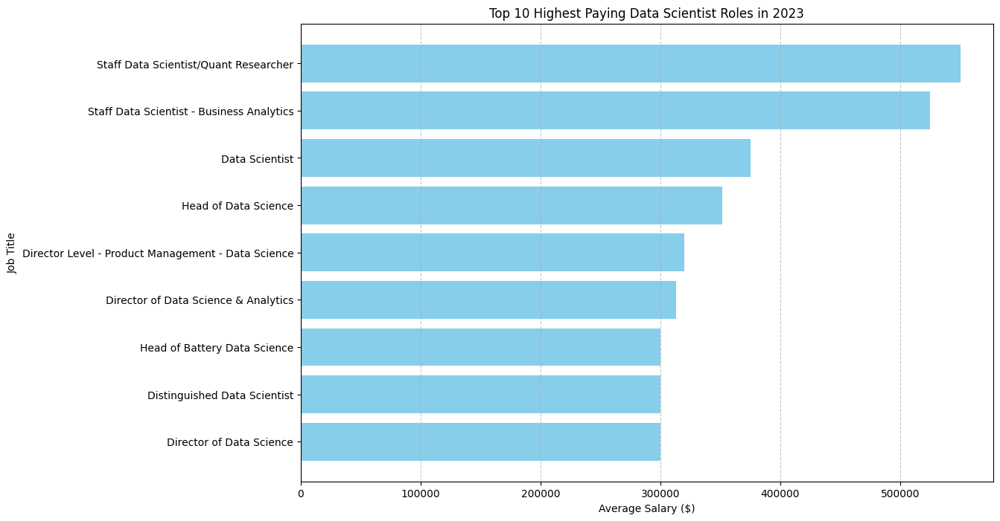

# Introduction
📊 Dive into the data job market! Focusing on data scientist roles, this project explores 💰 top-paying jobs, 🔥 in-demand skills, and 📈 where high demand meets high salary in data science.

🔍 SQL queries? Check them out here: [project_sql folder](/project_sql/)

# Background
Driven by a quest to navigate the data scientist job market more effectively, this project was born from a desire to pinpoint top-paid and in-demand skills, streamlining others work to find optimal jobs.

### The questions I wanted to answer through my SQL queries were:

1. What are the top-paying data scientist jobs?
2. What skills are required for these top-paying jobs?
3. What skills are most in demand for data scientists?
4. Which skills are associated with higher salaries?
5. What are the most optimal skills to learn?

# Tools I Used
For my deep dive into the data scientist job market, I harnessed the power of several key tools:

- **SQL:** The backbone of my analysis, allowing me to query the database and unearth critical insights.
- **PostgreSQL:** The chosen database management system, ideal for handling the job posting data.
- **Visual Studio Code:** My go-to for database management and executing SQL queries.
- **Git & GitHub:** Essential for version control and sharing my SQL scripts and analysis, ensuring collaboration and project tracking.

# The Analysis
Each query for this project aimed at investigating specific aspects of the data scientist job market. Here’s how I approached each question:

### 1. Top Paying Data Scientist Jobs
To identify the highest-paying roles, I filtered data scientist positions by average yearly salary and location, focusing on remote jobs. This query highlights the high paying opportunities in the field.

```sql
SELECT 
    job_id,
    company_dim.name AS company_name,
    job_title, 
    job_schedule_type, 
    salary_year_avg, 
    job_location,
    job_posted_date
FROM 
    job_postings_fact
LEFT JOIN
    company_dim
ON
    company_dim.company_id = job_postings_fact.company_id
WHERE 
    job_title_short = 'Data Scientist' AND 
    salary_year_avg IS NOT NULL AND 
    job_location = 'Anywhere'
ORDER BY 
    salary_year_avg DESC
LIMIT 10;
```
Here's the breakdown of the top data scientist jobs in 2023:
- **Wide Salary Range:** Top 10 paying data scientist roles span from $300,000 to $550,000, indicating significant salary potential in the field.
- **Diverse Employers:** Companies like Selby Jennings, Reddit, and Walmart are among those offering high salaries, showing a broad interest across different industries.
- **Job Title Variety:** There's a high diversity in job titles, from Data Scientist to Director of Data Science, reflecting varied roles and specializations within data science.


*Bar graph visualizing the salary for the top 10 salaries for data scientists*

### 2. Skills for Top Paying Jobs
To understand what skills are required for the top-paying jobs, I joined the job postings with the skills data, providing insights into what employers value for high-compensation roles.
```sql
WITH top_paying_jobs AS (
    SELECT 
        job_id,
        company_dim.name AS company_name,
        job_title, 
        salary_year_avg
    FROM 
        job_postings_fact
    LEFT JOIN
        company_dim
    ON
        company_dim.company_id = job_postings_fact.company_id
    WHERE 
        job_title_short = 'Data Scientist' AND 
        salary_year_avg IS NOT NULL AND 
        job_location = 'Anywhere'
    ORDER BY 
        salary_year_avg DESC
    LIMIT 10
)

SELECT
    top_paying_jobs.*,
    skills_dim.skills
FROM 
    top_paying_jobs
INNER JOIN 
    skills_job_dim
ON 
    top_paying_jobs.job_id = skills_job_dim.job_id
INNER JOIN
    skills_dim
ON 
    skills_dim.skill_id = skills_job_dim.skill_id
ORDER BY
    salary_year_avg DESC;
```
Here's the breakdown of the most demanded skills for the top 10 highest paying data scientist jobs in 2023:
- **SQL and Python** are leading with a count of 4 each.
- **Java** follows closely with a count of 3.
- **Spark, AWS, TensorFlow, and PyTorch** have moderate demand, appearing in 2 job postings each.
Other skills like **Scikit-learn**, **Numpy**, **Pandas**, and **Azure** show varying degrees of demand.

### 3. In-Demand Skills for Data Analysts

This query helped identify the skills most frequently requested in job postings, directing focus to areas with high demand.

```sql
SELECT 
    skills,
    COUNT(skills_job_dim.job_id) AS demand_count
FROM 
    job_postings_fact
INNER JOIN 
    skills_job_dim 
ON 
    job_postings_fact.job_id = skills_job_dim.job_id
INNER JOIN 
    skills_dim 
ON 
    skills_job_dim.skill_id = skills_dim.skill_id
WHERE
    job_title_short = 'Data Scientist' AND 
    job_work_from_home = True 
GROUP BY
    skills
ORDER BY
    demand_count DESC
LIMIT 10;
```
Here's the breakdown of the most demanded skills for data scientists in 2023
- **Python** and **SQL** lead the demand, underscoring the necessity for strong programming and database management skills. 
- Specialized Tools like **R**, **SAS**, and **Spark** highlight the importance of proficiency in statistical analysis and big data processing. 
- **Cloud Platforms** and **Visualization tools** such as **AWS**, **Azure**, **Tableau**, and **Pandas** emphasize the growing need for expertise in cloud computing and effective data presentation.

| Skills     | Demand Count |
|------------|--------------|
| python     | 10390        |
| sql        | 7488         |
| r          | 4674         |
| aws        | 2593         |
| tableau    | 2458         |

*Table of the demand for the top 5 skills in data scientist job postings*

### 4. Skills Based on Salary
Exploring the average salaries associated with different skills revealed which skills are the highest paying.
```sql
SELECT 
    skills,
    ROUND(AVG(salary_year_avg), 0) AS skill_avg_salary
FROM 
    job_postings_fact
INNER JOIN 
    skills_job_dim 
ON 
    job_postings_fact.job_id = skills_job_dim.job_id
INNER JOIN 
    skills_dim 
ON 
    skills_job_dim.skill_id = skills_dim.skill_id
WHERE
    job_title_short = 'Data Scientist' AND 
    salary_year_avg IS NOT NULL AND
    job_work_from_home = True 
GROUP BY
    skills
ORDER BY
    skill_avg_salary DESC
LIMIT 25;
```
Here's a breakdown of the results for top paying skills for Data Scientists:
- **High Demand for Specialized Programming Languages and Tools:** Top salaries are commanded by skills in GDPR ($217,738), Golang ($208,750), and Elixir ($161,250), indicating a premium on specialized programming languages and compliance knowledge that are critical for niche applications and regulatory requirements.
- **Expertise in Big Data and Cloud Technologies:** Skills in DynamoDB ($169,670), Neo4j ($171,655), and Cassandra ($160,850) are highly valued, reflecting the industry's need for professionals who can manage and analyze large datasets efficiently in cloud environments.
- **Proficiency in Advanced Data and Development Tools:** Tools such as MicroStrategy ($171,147), Airflow ($157,414), and DataRobot ($164,500) highlight the importance of advanced data analytics, workflow automation, and machine learning platforms, which are crucial for sophisticated data processing and decision-making processes.


| Skills         | Skill Avg Salary |
|----------------|------------------|
| gdpr           | 217738           |
| golang         | 208750           |
| atlassian      | 189700           |
| selenium       | 180000           |
| opencv         | 172500           |
| neo4j          | 171655           |
| microstrategy  | 171147           |
| dynamodb       | 169670           |
| php            | 168125           |
| tidyverse      | 165513           |

*Table of the average salary for the top 10 paying skills for data scientists*

### 5. Most Optimal Skills to Learn

Combining insights from demand and salary data, this query aimed to pinpoint skills that are both in high demand and have high salaries, offering a strategic focus for skill development.

```sql
SELECT 
    skills_dim.skill_id,
    skills_dim.skills,
    COUNT(skills_job_dim.job_id) AS demand_count,
    ROUND(AVG(job_postings_fact.salary_year_avg), 0) AS avg_salary
FROM job_postings_fact
INNER JOIN skills_job_dim ON job_postings_fact.job_id = skills_job_dim.job_id
INNER JOIN skills_dim ON skills_job_dim.skill_id = skills_dim.skill_id
WHERE
    job_title_short = 'Data Scientist'
    AND salary_year_avg IS NOT NULL
    AND job_work_from_home = True 
GROUP BY
    skills_dim.skill_id
HAVING
    COUNT(skills_job_dim.job_id) > 10
ORDER BY
    avg_salary DESC,
    demand_count DESC
LIMIT 25;
```

| Skill ID | Skills    | Demand Count | Avg Salary |
|----------|-----------|--------------|------------|
| 26       | c         | 48           | 164865     |
| 8        | go        | 57           | 164691     |
| 187      | qlik      | 15           | 164485     |
| 185      | looker    | 57           | 158715     |
| 96       | airflow   | 23           | 157414     |
| 77       | bigquery  | 36           | 157142     |
| 3        | scala     | 56           | 156702     |
| 81       | gcp       | 59           | 155811     |
| 80       | snowflake | 72           | 152687     |
| 101      | pytorch   | 115          | 152603     |

*Table of the most optimal skills for data scientist sorted by salary*

Here's a breakdown of the most optimal skills for Data Scientists in 2023: 
- **High-Demand Programming Languages and Tools:** Python (demand count: 763, avg salary: $143,828) and Spark (demand count: 149, avg salary: $150,188) are among the top skills, emphasizing the need for expertise in versatile programming and big data processing technologies. Despite high demand, their average salaries indicate a balance between necessity and availability.
- **Cloud and Big Data Technologies:** Skills in AWS (demand count: 217, avg salary: $149,630), GCP (demand count: 59, avg salary: $155,811), and Snowflake (demand count: 72, avg salary: $152,687) are highly sought after, reflecting the growing importance of cloud platforms and efficient data management in modern data science roles.
- **Data Visualization and Business Intelligence:** Tableau (demand count: 219, avg salary: $146,970) and Looker (demand count: 57, avg salary: $158,715) are critical for data visualization, underscoring the essential role of data storytelling and business intelligence in making data-driven decisions.
- **Specialized and Emerging Technologies:** Skills like Airflow (demand count: 23, avg salary: $157,414), Qlik (demand count: 15, avg salary: $164,485), and Pytorch (demand count: 115, avg salary: $152,603) are valued for their specialized applications in workflow automation, data analytics, and machine learning, indicating a premium for expertise in cutting-edge tools.
- **Database Management and Processing:** Proficiency in SQL-based and NoSQL databases such as Redshift (demand count: 36, avg salary: $151,708), Cassandra (demand count: 34, avg salary: $160,850), and DynamoDB (demand count: 169,670) highlights the enduring need for robust data storage and retrieval skills in handling large datasets efficiently.

# What I Learned

Throughout this adventure, I've turbocharged my SQL toolkit with some serious firepower:

- **🧩 Complex Query Crafting:** Mastered the art of advanced SQL, merging tables like a pro and wielding WITH clauses for ninja-level temp table maneuvers.
- **📊 Data Aggregation:** Got cozy with GROUP BY and turned aggregate functions like COUNT() and AVG() into my data-summarizing sidekicks.
- **💡 Analytical Wizardry:** Leveled up my real-world puzzle-solving skills, turning questions into actionable, insightful SQL queries.

# Conclusions

### Insights
From the analysis, several general insights emerged:

1. **Top-Paying Data Scientist Jobs**: The highest-paying jobs for data scientists that allow remote work offer a wide range of salaries, the highest at $550,000!
2. **Skills for Top-Paying Jobs**: High-paying data analyst jobs require advanced proficiency in Python, suggesting it’s a critical skill for earning a top salary.
3. **Most In-Demand Skills**: Python, SQL is also the most demanded skill in the data scientist job market, thus making it essential for job seekers.
4. **Skills with Higher Salaries**: programming skills, such as C and Go, are associated with the highest average salaries, indicating a premium on niche expertise.
5. **Optimal Skills for Job Market Value**: Python, SQL leads in demand and offers for a high average salary, positioning them as the most optimal skills for data scientists to learn to maximize their market value.

### Closing Thoughts

This project enhanced my SQL skills and provided valuable insights into the data scientist job market. The findings from the analysis serve as a guide to prioritizing skill development and job search efforts. Aspiring data scientists can better position themselves in a competitive job market by focusing on high-demand, high-salary skills. This exploration highlights the importance of continuous learning and adaptation to emerging trends in the field of data science.